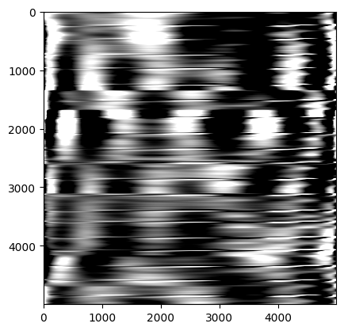
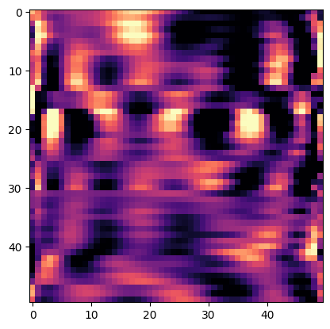

# OPI: Orthogonal Polynomial Imaging for 12-Lead ECG Classification

Code and reproducibility materials for **"Higher-Dimensional Embedding of Time-Series Data for Machine Learning"** (Singh, Nath, Sinha & Sinha).

Most clinical biosignals — especially multi-lead ECGs — are one-dimensional and awkward for modern vision models. This repository implements **Orthogonal Polynomial Imaging (OPI)**, a framework that encodes a 12-lead ECG into a single two-dimensional image via an invertible orthogonal-polynomial superposition, prior to coarse-graining. Each lead is superposed onto the image using a distinct orthonormal basis function (Legendre by default; Chebyshev also explored), so the transform is exactly invertible before coarse-graining and every lead's temporal signal is recoverable by projection. The resulting compact images are then classified with standard image-based architectures (CNNs, ResNet) and benchmarked against strong 1D baselines (Transformer, 1D ResNet, FFNN) trained directly on the raw waveforms.

<p align="center">
  
  
</p>
<p align="center"><em>Left: full-resolution OPI superposition of a 12-lead ECG. Right: coarse-grained image (pseudocolor for visualization; the actual representation used for training is single-channel).</em></p>

## Method summary

1. **Superposition** — each ECG lead $f_l(t)$ is outer-producted with an orthonormal polynomial basis vector $\mathbf{p}_l$ and summed: $\mathbf{I} = \sum_{l=1}^{12} \mathbf{f}_l \mathbf{p}_l^{T}$, producing a $5000 \times 5000$ image. Implemented in [`encoding.py`](encoding.py) (`superposition()`).
2. **Invertibility** — because $\{\mathbf{p}_l\}$ is orthonormal, each lead is exactly recoverable via $\mathbf{f}_l = \mathbf{I}\mathbf{p}_l$; no information is lost prior to coarse-graining. Implemented in [`encoding.py`](encoding.py) (`inverse_superposition()`); empirically validated in [`invertibility/`](invertibility).
3. **Coarse-graining** — block-averaging reduces the image to $100\times100$ or $50\times50$ for efficient training. Implemented in [`smoothening.py`](smoothening.py) (`coarsegrain()`).
4. **Classification** — a compact CNN (`SmallCNN`), a ResNet-18 baseline (`ECGResNet`), a raw-signal `VanillaTransformerECG`, a raw-signal `ResNet1D` (from the [`selfeeg`](https://pypi.org/project/selfeeg/) package), and an FFNN baseline are trained on three-class rhythm classification (Sinus Tachycardia / Sinus Bradycardia / Sinus Rhythm) using the [PhysioNet ECG-Arrhythmia Database](https://physionet.org/static/published-projects/ecg-arrhythmia/a-large-scale-12-lead-electrocardiogram-database-for-arrhythmia-study-1.0.0.zip).

All experiments use a patient-wise 70/15/15 split, five random seeds (40–44), and are repeated across two dataset configurations (Type 1: single-diagnosis patients; Type 2: patients with comorbidities). See the paper for full methodological detail.

## Headline results

The OPI-encoded 100×100 CNN (Legendre basis, Type 1 data) achieves **98.58% ± 0.13% accuracy**, with per-class AUC of 0.999 (SB), 0.999 (ST), 0.999 (SR) — competitive with, and in most configurations exceeding, the 1D Transformer, 1D ResNet, and 2D ResNet-18 baselines trained on the raw signal. Full per-model metrics (confusion matrices, ROC/PR curves, classification reports) for every configuration in the paper are in [`results/`](results) and summarized in [`results/analysis.ipynb`](results/analysis.ipynb).

## Repository structure

This repo mirrors the paper's pipeline: data preparation → polynomial encoding → model training → analysis.

```
ECG_ML/
├── data_prep/            # Filters raw PhysioNet records into Type 1 / Type 2 datasets
├── encoded_ecg_data/      # Legendre / Chebyshev / Hermite OPI encoding notebooks + outputs
├── invertibility/         # Empirical verification that OPI is invertible pre-coarse-graining
├── example_data/          # Sample .mat records for quick pipeline testing
├── figures/               # Figures and diagram-generation notebooks
├── encoding.py             # >>> Core OPI implementation: superposition() / inverse_superposition()
├── smoothening.py          # >>> Core OPI implementation: coarsegrain()
├── model_cnn.py, model_nn.py, resnet1d.py, vanilla_transformer_ecg.py
│                           # Model architectures (SmallCNN, ECGResNet, ResNet1D, VanillaTransformerECG)
├── dataloader.py, dataseperation.py, seed_utils.py, plots.py
│                           # Shared utilities (data loading, splits, seeds, plotting)
├── main_*.ipynb            # One training notebook per experimental configuration in the paper
└── results/                # analysis.ipynb + one EXPERIMENT_*/ folder per configuration
                             # (logs, metrics, confusion/ROC/PR plots)
```

Each subdirectory has its own README with further detail: [`data_prep/README.md`](data_prep/README.md), [`encoded_ecg_data/README.md`](encoded_ecg_data/README.md), [`invertibility/README.md`](invertibility/README.md), [`example_data/README.md`](example_data/README.md), [`figures/README.md`](figures/README.md), [`results/README.md`](results/README.md).

## Installation

```bash
pip install -r requirements.txt
```

Requires Python 3.8+, PyTorch/torchvision, NumPy, pandas, SciPy, scikit-learn, matplotlib, seaborn, `wfdb` (for reading the raw PhysioNet records) and `selfeeg` (for the 1D ResNet baseline). Experiments were run on an NVIDIA RTX 3050 (CUDA), with CPU fallback supported.

## Reproducing the experiments

1. **Prepare data**: download the PhysioNet database and run [`data_prep/data_prep.ipynb`](data_prep/data_prep.ipynb) (and `data_prep_for_only_one_disease.ipynb` for Type 1).
2. **Encode**: run [`encoded_ecg_data/smooth_using_normlised_legendre.ipynb`](encoded_ecg_data/smooth_using_normlised_legendre.ipynb) (or the Chebyshev/Hermite notebook) to generate OPI images.
3. **Train**: run any `main_*.ipynb` notebook — each corresponds to one row of the paper's model-configuration table (e.g. `main_2d_leg_typ1.ipynb` = OPI-CNN, Legendre, Type 1). Results are written to a matching `results/EXPERIMENT_*/` folder.
4. **Analyze**: run [`results/analysis.ipynb`](results/analysis.ipynb) to aggregate metrics across all experiments and seeds.

All training runs are deterministic given a seed (see `seed_utils.py`) and use the same five seeds (40–44) reported in the paper.

## Data availability

Raw and processed ECG data are **not distributed in this repository** (see `.gitignore`); they are derived from the publicly available [PhysioNet ECG-Arrhythmia Database](https://physionet.org/static/published-projects/ecg-arrhythmia/a-large-scale-12-lead-electrocardiogram-database-for-arrhythmia-study-1.0.0.zip). [`example_data/`](example_data) provides two sample records for testing the pipeline without downloading the full dataset.

## Citation

If you use this code, please cite:

> Singh, K., Nath, P. P., Sinha, U., & Sinha, A. *Higher-Dimensional Embedding of Time-Series Data for Machine Learning.* (Manuscript under review, Frontiers)

## Acknowledgments

See the paper for full acknowledgments and funding sources.
